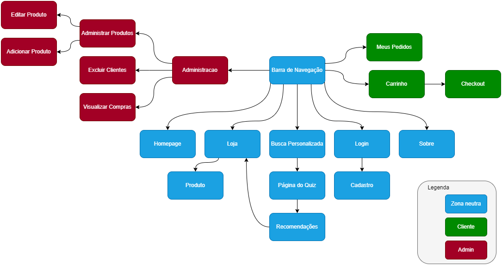

# Web Project - Plant Store

- Luísa Balleroni Shimabucoro - 11832385
- Matheus Bermudes Viana - 11849797
- Wictor Dalbosco Silva - 11871027

Link to hosted website test: https://plant-shop-matheusbviana.vercel.app

## Tools and languages used for this project

<div style="display: flex">
&nbsp
<a href="#"></a>
&nbsp &nbsp &nbsp &nbsp  &nbsp 
<a href="#"></a>
&nbsp &nbsp &nbsp &nbsp  &nbsp
<a href="#"></a>
&nbsp &nbsp &nbsp &nbsp  &nbsp
<a href="#"></a>
</div>
 &nbsp  &nbspFigma &nbsp &nbsp &nbsp &nbsp &nbspHTML &nbsp &nbsp &nbsp &nbsp &nbspNode.js &nbsp &nbsp &nbsp &nbsp &nbsp React

## Requirements
- The system must have two types of users:
  - *Administrators*: They are responsible for managing administrators, clients, and products. To use the administrator account, use the credentials admin@admin.com:admin123 in the format (email:password)
  - *Clients*: They are users who access the system to buy products.

- To store the data, it is necessary to have the following records:
  - *admin*: id, name, phone, and email
  - *client*: id, name, address, phone, and email
  - *product*:  id, name, photo, description, price, quantity in stock, and quantity sold.

- Selling products (or services): products are selected, their quantities defined, and finally added to the cart. Products are purchased using a credit card number (any number is accepted by the system). The quantity of the product sold is subtracted from the quantity in stock and added to the quantity of products sold. Carts are emptied only after payment or by a direct action of the user.

- Management of products/services: administrators can create/update/read/delete (CRUD) new products and services. For example, they can change the quantity of products in stock.

- **Specific functionality:** the client can select the type of residence (house or apartment) and characteristics such as room lighting, temperature, and available time for maintenance. With this, the application offers suggestions for plants that meet at least 3 of the 4 criteria.

- The system must meet accessibility requirements and provide good usability. Additionally, the system should be responsive.


## Project Description
This project consists of developing an online application for a plant shop, which will have the following functionalities:

- Signup and Login
- Add or remove products from the cart
- Checkout process
- Product search filters
Options for customer and product management exclusive to system administrators
- **Specific functionality:** the customer can select the type of residence (house or apartment) and characteristics such as room lighting, temperature, and available maintenance time. With this, the application offers suggestions for plants that meet at least 3 out of 4 criteria.

In order for these functionalities to work properly, it will be necessary to store the following information:
  - *admin*: id, name, phone, and email
  - *client*: id, name, address, phone, and email
  - *general product:* id, name, photo, description, price, stock quantity, and sold quantity
    - *plant*:  in addition to the standard attributes, they have size, ideal lighting level, temperature, ideal maintenance, and category.

### Navigation Diagram


<a href="https://www.figma.com/file/3dgTdFB6VzP9HX0n41i1g5/Plant-Shop-Website-(Practice-%23001)-(Community)-(Copy)?node-id=0%3A1">Projeto no Figma</a>

## Comments on the Code
## Testing Plan

Manual tests will be executed for login and registration, product management, user and administrator management, filtering, search, and also simulation of purchases in various scenarios.

No additional frameworks will be used for testing.

To create admin users, remember to use admin@admin.com:admin in the format (email:password).

### Following a Testing Script

1. **Signup Test**
	* Signup with an invalid email
	* Signup with the password field not matching the password confirmation field
	* Signup with a password less than 8 characters
	* Signup filled correctly with valid data
	* Signup using the same email as a previously registered account

2. **Login Test**
	* Login with empty fields
	* Login with invalid fields (email without "@", password less than 8 characters, etc.)
	* Login with correctly filled fields
	* Logout

3. **Search Test**
	* Search in the product search field "computer"
	* Search in the product search field "indoor plant"
	* Search in the search field for "plant"

4. **Test with specific personalized search functionality**
	* Perform a search with less than 4 filled fields
	* Perform a search by filling in, respectively, the fields "Medium," "Medium," "Average," and "Little"

5. **Navigation Test**
	* Navigation through the client's pages (Home, Shop, Personalized Search, About, Cart, and My Orders)
	* Navigation with admin (client pages + Customers, Products, Purchases, Edit Customer, Edit Product)

6. **Product Selection Test**
	* Go to the shop section, filter by most expensive products first, click on the product, change its quantity, and add it to the cart

7. **Cart and Checkout Test**
	* Purchase with an empty cart
	* Edit the quantity of a specific product within the cart
	* Remove a product from the cart

8. **Edit Product Test**
	* Change information of the product that needs to be changed and search for the product in the navigation bar.

9. **Insert Product Test**
	* Insert product with empty fields
	* Insert product with invalid fields (ex: price: "twenty"; invalid URL)

10. **Remove Product Test**
	* Removing a product.

11. **Remove Customer Test**
	* Removing a customer.

12. **View Orders Test (Admin)**
	* Viewing which orders were made.

13. **View Purchases Test (Client)**
	* Client viewing their purchases

14. **View Products Test (Admin)**
	* Administrator viewing the products

## Test Results

### Expected Results According to Testing Plan

1. **Registration test**
	* Alert message for invalid email and warning message for registration form text field
	* Alert message for non-matching passwords
	* Alert message for password length requirement (minimum 8 characters)
	* Successful registration and login, providing access to the shopping cart, "My Orders" tab, and logout button if the customer wishes to exit their newly created account
	* Alert message for already registered email
2. **Login test**
	* Alert message for incorrect email or password
	* Alert message for incorrect email or password and warning message for login form text field
	* Successful login, providing access to the shopping cart, "My Orders" tab, and logout button if the customer wishes to exit their newly created account
	* Logout successful, causing the shopping cart and "My Orders" tabs to disappear
3. **Search test**
	* Nothing is returned in the store session, as the product does not exist in the store's catalog
	* Indoor plants present in the store's catalog are returned
	* All products in the "Plant" category are returned
4. **Test with specific custom search functionality**
	* Alert message asking the customer to fill in all fields
	* Plants with these characteristics are returned
5. **Navigation test**
	* All pages should be accessible and functional
	* All pages should be accessible and functional
6. **Product selection test**
	* The most expensive products in the store should appear (equipment), then when clicked their data appears on the product page and their quantity can be changed between the values [1, current stock] and when the add to cart button is clicked the product is placed on the customer's cart page
7. **Cart and checkout test**
	* Alert message for the customer that they have no items in their cart
	* Quantity must be able to be changed between the values [1, current stock]
	* Product is successfully removed from the cart
8. **Edit product test**
	* The edited product should be found when searching for the updated characteristics
9. **Insert product test**
	* Alert message for the admin that all product data fields must be filled out
	* Alert message for the admin that the image link is invalid
10. **Remove product test**
	* Alert message notifying that the product has been removed, and the product should no longer be found in the store
11. **Remove customer test**
	* The customer is removed, and it is no longer possible to log into their account
12. **View orders test (admin)**
	* If there are any purchases, they will be displayed in a list, showing the buyer, product, and price.
13. **View purchases test (customer)**
	* Purchases will be displayed in a list, with purchase information and the last 4 digits of the card used.
14. **View products test (admin)**
	* All existing products in the store should be displayed, with the ability for the admin to edit them.


## Build Instructions

Para poder testar o site é necessário ter o [Node](https://nodejs.org/en/download/) e seu gerenciador de pacotes [npm](https://nodejs.org/en/download/) instalados.

Once installed, the files located in the Milestone3 directory are needed, and the following commands should be run:

Important: The Windows display configuration must be set to 100%, as well as your browser's zoom :)
**The folder is "EntregaFinal", you can disregard the others

Within the backend folder:

```
npm install
npm run server
```
With the server running, run within the frontend folder:

```
npm install
npm start
```


A tab should open in your browser, if it does not, just access 'http://localhost:3000/'


## Issues
After several tests, we were unable to detect any problems with the website's functionality. Initially, we had difficulty connecting to the MongoDB database, but after watching the tutorial carefully, we were able to integrate it normally.


## Comments
The project helped a lot in consolidating our knowledge in WEB, especially in the use of React and Node.js. It was extremely productive and didactic, and it will certainly help us in the future when we deal with web development again.


